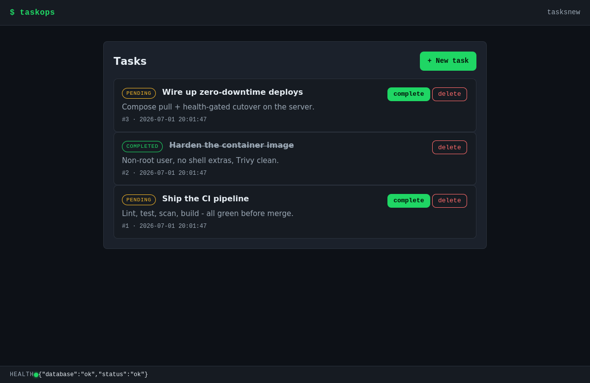

# TaskOps — Production-Style CI/CD Pipeline for a Flask App


> A small Flask + SQLite task tracker that exists to showcase a **production-style
> CI/CD pipeline** — not to be a feature-rich product. The Flask app is
> intentionally simple so the **DevOps and delivery engineering** around it can
> be the focus.

**Positioning (honest):** this is a **production-style CI/CD portfolio project**,
suitable for a **junior / mid DevOps / CI-CD portfolio**. It is *not* a fully
production-ready web application or an enterprise SaaS product. See
[Limitations](#limitations) and [docs/security.md](docs/security.md) for an
honest scope.

---

## Why this project exists

Most demo apps stop at "it runs locally." TaskOps focuses on the part employers
actually care about for a DevOps/platform role: getting a simple app **tested,
scanned, containerized, published, and deployed** through an automated pipeline.

## What this project demonstrates

- Clean Flask structure (application-factory, isolated data layer, env-based
  config, no hardcoded secrets).
- Automated testing with `pytest` (25 tests) including an XSS-escaping test.
- Code-quality gates: `ruff`, `black`, `isort`.
- Security scanning: `bandit` (SAST), `pip-audit` (dependencies), `Trivy` (image).
- Containerization with Docker + Docker Compose, non-root and healthchecked.
- Image publishing to **GitHub Container Registry (GHCR)**.
- **Deployment automation** to a Linux server over SSH, behind an **nginx**
  reverse proxy via `docker compose`.
- Operational tooling: **backup**, **rollback**, and **smoke-test** scripts.
- Thorough, honest documentation.

## Tech stack

| Area              | Choice                                               |
| ----------------- | ---------------------------------------------------- |
| Language          | Python 3.12                                          |
| Web framework     | Flask 3.1.3                                           |
| WSGI server       | gunicorn 23.0.0 (2 workers, in container)            |
| Templating        | Jinja2 (autoescaping on)                             |
| Database          | SQLite (standard library `sqlite3`)                  |
| Styling           | Hand-written CSS (no framework)                      |
| Tests             | pytest (25 tests)                                    |
| Lint / format     | ruff, black, isort                                   |
| Security          | bandit (SAST), pip-audit (deps), Trivy (image)       |
| Container         | Docker (`python:3.12-slim`), docker compose          |
| Reverse proxy     | nginx (production)                                   |
| CI/CD             | GitHub Actions                                       |
| Registry          | GitHub Container Registry (ghcr.io)                  |

## Application features

- Create, list, complete, and delete tasks.
- Server-side validation: title required and capped at `MAX_TITLE_LENGTH`
  (default 120); description optional; empty/whitespace rejected; form
  re-rendered with input preserved on error.
- `GET /health` returns JSON `{"status":"ok","database":"ok"}` for probes
  (503 with `{"status":"error","database":"down"}` if the DB check fails).
- SQLite data layer isolated from routes; **every query is parameterized**.
- User content rendered through Jinja autoescaping (XSS-safe; covered by a test).
- Structured stdout logging; warns if the insecure dev secret key is used.

## DevOps & CI/CD features

- **CI** on every push and PR: format check, lint, tests, SAST, dependency
  audit, Docker build, and **Trivy image scan**.
- **CD** on push to `main`: build → Trivy scan → publish to GHCR (`:<sha>` and
  `:latest`) → deploy over SSH → `docker compose` behind nginx → smoke test.
- Non-root, healthchecked container image with a deps-cached build.
- Configurable image reference (`IMAGE`/`IMAGE_TAG`) — no personal path baked in.
- Backup, rollback, and smoke-test scripts for production-style operations.

## Architecture

```
Developer
  │  git push
  ▼
GitHub repository  ──►  CI pipeline (push / PR)
  │                       ruff · black · isort · pytest · bandit · pip-audit
  │ push to main          docker build · Trivy scan · /health smoke
  ▼
CD pipeline (cd.yml)
  │  verify gates → docker build → Trivy scan → push
  ▼
GHCR  (ghcr.io/<owner>/taskops:<sha> + :latest)
  │  scp compose+nginx+scripts, then ssh deploy.sh
  ▼
Linux server  ──►  docker compose -f docker-compose.prod.yml up -d
  ▼
nginx  (:80)
  ▼
Flask / gunicorn  (:5000, 2 workers)
  ▼
SQLite  (persistent /data volume)

post-deploy: smoke_test.sh ─► http://DEPLOY_HOST/health
```

More detail: [docs/architecture.md](docs/architecture.md).

## Local setup

Requires Python 3.12.

```bash
python -m venv .venv

source .venv/bin/activate          # macOS / Linux
# .venv\Scripts\Activate.ps1        # Windows PowerShell

pip install -r requirements-dev.txt
python -m pytest                   # run the test suite
python wsgi.py                     # dev server on http://127.0.0.1:5000
```

> gunicorn is a Linux/WSGI server used inside the container. On Windows, use the
> dev server (`python wsgi.py`) or run via Docker.

Confirm:

```bash
curl http://127.0.0.1:5000/health   # {"status":"ok","database":"ok"}
```

## Docker setup

Build and run the image directly:

```bash
docker build -t taskops:test .
docker run -p 5000:5000 -e FLASK_SECRET_KEY=test taskops:test
curl http://localhost:5000/health
```

Local dev stack (builds the image, named volume for the database):

```bash
docker compose up --build           # app on http://localhost:${APP_PORT:-5000}
```

Production stack (image behind nginx). First validate the config, then run:

```bash
docker compose -f docker-compose.prod.yml config        # validate (needs FLASK_SECRET_KEY)
IMAGE=ghcr.io/<owner>/taskops IMAGE_TAG=latest FLASK_SECRET_KEY=... \
  docker compose -f docker-compose.prod.yml up -d        # nginx on :80 -> app :5000
```

The image is `python:3.12-slim`, runs as a **non-root** user, stores SQLite under
the `/data` volume, and has a `HEALTHCHECK` that curls `/health`.

## Running tests

```bash
python -m pytest        # 25 tests
```

Covered in `tests/`:

- `test_routes.py` — page loads, create/complete/delete, validation, DB
  persistence of completion, correct-task deletion, safe no-ops & 404s.
- `test_database.py` — schema creation, insert/retrieve, list, update, delete,
  missing-row handling (inside an app context).
- `test_health.py` — `/health` returns 200 `{"status":"ok","database":"ok"}`,
  and 503 when the DB connectivity check fails.
- `test_security.py` — task title/description are HTML-escaped (XSS-safe).

## Code quality & security checks

```bash
python -m pytest
ruff check .
black --check .
isort --check-only .
bandit -r app
pip-audit -r requirements.txt
```

Or via the `Makefile`:

```bash
make install   # create .venv and install dev requirements (run this first)
make help      # list targets
make check     # lint + format-check + test + security + audit
make clean     # remove caches and build artifacts
```

> The `Makefile` targets use the project virtualenv (`.venv/`), so run
> `make install` once before `make test`/`make check`. Alternatively, set up the
> environment manually (`python -m venv .venv` → activate →
> `pip install -r requirements-dev.txt`) and call the tools directly.

Security controls: parameterized SQL, Jinja autoescaping, non-root container,
secrets only from the environment, plus the three scanners above (Trivy runs in
CI/CD against the built image). Honest scope: [docs/security.md](docs/security.md).

## CI pipeline

[.github/workflows/ci.yml](.github/workflows/ci.yml) — runs on **push (any
branch)** and **pull_request**:

- `quality`: `ruff` → `black --check` → `isort --check-only` → `pytest` →
  `bandit` → `pip-audit`.
- `docker` (needs `quality`): build the image → **Trivy scan** (fail on
  fixable HIGH/CRITICAL) → run the container → smoke-test `/health`.

## CD pipeline

[.github/workflows/cd.yml](.github/workflows/cd.yml) — runs **only on push to
`main`**:

- `verify`: re-runs the core gates (lint, format, tests, bandit) so broken code
  is never deployed.
- `deploy` (needs `verify`): build image → **Trivy scan before publishing** →
  push to GHCR (`:<sha>` and `:latest`) → copy compose + nginx + scripts to the
  server → run `deploy.sh` (compose up behind nginx) → smoke-test
  `http://<DEPLOY_HOST>/health`.

Walkthrough: [docs/ci-cd-pipeline.md](docs/ci-cd-pipeline.md).

## Deployment strategy

Production runs the GHCR image **behind nginx** via `docker-compose.prod.yml`:
nginx (`taskops-nginx`) on port 80 proxies to `taskops-app` (gunicorn :5000),
with SQLite on a persistent `taskops-data` volume. Full guide:
[docs/deployment.md](docs/deployment.md).

Scripts in `scripts/`:

- `deploy.sh` — write a `0600` compose `.env`, `compose pull && up -d`, wait for
  `/health` through nginx; records the previous tag for rollback.
- `rollback.sh` — revert to the previously recorded tag and re-deploy.
- `backup_db.sh` — consistent, timestamped SQLite backup.
- `smoke_test.sh` — assert `/health` returns `status: ok`.

## Required GitHub secrets

| Secret             | Required | Purpose                                            |
| ------------------ | -------- | -------------------------------------------------- |
| `GITHUB_TOKEN`     | auto     | GHCR login/push (Actions); forwarded to pull image |
| `DEPLOY_HOST`      | yes      | Server hostname/IP (ssh, scp, smoke test)          |
| `DEPLOY_USER`      | yes      | SSH username                                       |
| `DEPLOY_SSH_KEY`   | yes      | Private SSH key (full PEM)                          |
| `DEPLOY_PORT`      | yes      | SSH port (e.g. 22)                                 |
| `FLASK_SECRET_KEY` | yes      | Flask session key for the production container     |

`GITHUB_TOKEN` is provided automatically. Note the app reads **`FLASK_SECRET_KEY`**
(not `APP_SECRET_KEY`). Details: [docs/deployment.md](docs/deployment.md).

> **Recommended:** enable **branch protection** on `main` (require a PR and
> passing CI status checks) so CD only ever deploys verified code. See
> [docs/deployment.md](docs/deployment.md#recommended-branch-protection).

## Environment variables

| Variable           | Consumed by      | Default              | Purpose                              |
| ------------------ | ---------------- | -------------------- | ------------------------------------ |
| `FLASK_SECRET_KEY` | app              | dev fallback (warns) | Flask session signing key            |
| `DATABASE_PATH`    | app              | `taskops.db`         | SQLite database location             |
| `MAX_TITLE_LENGTH` | app              | `120`                | Max task title length                |
| `APP_PORT`         | dev compose      | `5000`               | Host port → container 5000 (dev)     |
| `IMAGE`/`IMAGE_TAG`| prod compose     | placeholder / `latest` | Image to run in production         |
| `HTTP_PORT`        | prod compose     | `80`                 | Host port for nginx                  |
| `FLASK_ENV`        | convention only  | `development`        | Environment name (not read by app)   |

Copy `.env.example` to `.env` for local use. Production **requires**
`FLASK_SECRET_KEY`.

## Screenshots

Screenshots live in [`docs/screenshots/`](docs/screenshots/) — see that
directory's README for the suggested captures and filenames. Once added, embed
them here, for example:

```markdown


```

They are not committed yet (and are not faked); add real captures after the
first deploy.

## Limitations

Stated honestly so the scope is not overclaimed:

- The Flask app is **intentionally simple** (a vehicle for the pipeline).
- **No authentication / authorization** — all routes are public.
- **No CSRF protection** on POST forms.
- **SQLite is demo / small-deployment level** — single-writer, not for
  multi-instance scale-out.
- **No HTTPS by default** — nginx serves plain HTTP on port 80.
- **Real CD must be run against a configured server** — the workflows are
  reviewed and validated locally but GitHub Actions + the SSH deploy can only be
  confirmed after pushing and configuring secrets/server.

## Future improvements

- CSRF protection (e.g. **Flask-WTF**).
- User accounts / authentication; per-user task lists.
- **HTTPS** via Let's Encrypt / Caddy / Traefik.
- **PostgreSQL** backend for multi-instance deploys.
- **Dependabot** for automated dependency updates.
- Broader **SAST/DAST** coverage; blue/green or rolling deploys; IaC
  (Terraform/Ansible).

## Resume bullet points

- Built a **production-style CI/CD pipeline** for a Flask application using
  GitHub Actions, Docker, and automated testing.
- Implemented quality gates including formatting checks, linting, unit tests,
  security scanning (bandit), dependency auditing (pip-audit), Docker image
  building, and **Trivy image scanning**.
- Containerized a Flask + SQLite application with Docker and Docker Compose,
  including a production-style **nginx reverse proxy** setup.
- Automated Docker image publishing to **GitHub Container Registry** and
  deployment to a Linux server through **SSH**.
- Added deployment, backup, rollback, smoke-testing, and troubleshooting
  documentation for production-style operations.

## Troubleshooting

Common failures and fixes: [docs/troubleshooting.md](docs/troubleshooting.md).

## License

[MIT](LICENSE) © 2026 Mehran Bayat
